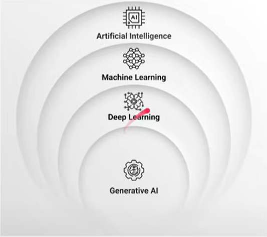

# Generative AI 

- Generative AI generates new data (image, text, audio, video) as output, based on the training sample.
- Machine Learning is a subset of Artificial Intelligence, Deep learning is a subset of Machine learning and generative AI is the subset of Deep Learning.

## Large Language Models 
- LLM's are machine learning models that use deep learning algorithms to process and understand natural language.
- They are trained on massive amounts of text data to learn patterns and entity relationships in the language.
- A single LLM model can be used to perform a whole variety of tasks like text to text generation, text to image generation, image to text generation, language translation, chatbot, summarizer and code generation. This makes LLMs quite powerful.
- Eg: Gemini, GPT, XLM, T5, Llama

## Generative AI Pipeline
- A set of steps followed to build an end to end GenAI software
    - Data acquisition
    - Data preparation
    - Feature engineering
        - One hot encoding 
        - Bag of word (BOW)
        - TFIDF
        - Word2Vec
        - Transformers
    - Modeling
    - Evaluation
    - Deployment
    - Monitoring and model updating 

## Code 

- [Text Preprocessing Template](./text_preprocessing_template.ipynb)
- [Text Representation into vectors (Feature Engineering)](./text_representation.ipynb)
- [Text Classification Example using Machine Learning Models](./Text_Classification_Example_.ipynb)
- [Hugging Face Language Model Examples](./hugging_face.ipynb)
- [Text Summarization using Language Models from hugging face](./Text_Summarizer.ipynb)
- [Text to image generation using Language Models from hugging face](./TextToImageGeneration.ipynb)
- [Text to speech generation using Language Models from hugging face](./TextToSpeechGeneration.ipynb)
- [OpenAI API demo](./openai-demo/openai-demo.ipynb)
- [Telegram Chatbot using openAI API ](./telegram-chatbot/telegram_chatbot.py)
- [Fine Tunning OpenAI Model for Classification Tasks](./FineTunningOpenAIModelForClassification.ipynb)

## Resources 
- [Generative AI for Developers – Comprehensive Course](https://www.youtube.com/watch?v=F0GQ0l2NfHA)
- [A list of open LLMs available for commercial use.](https://github.com/eugeneyan/open-llms)
- [Attention Is All You Need Research Paper - Transformer Architecture](https://proceedings.neurips.cc/paper_files/paper/2017/file/3f5ee243547dee91fbd053c1c4a845aa-Paper.pdf)
- [The Illustrated Transformer](https://jalammar.github.io/illustrated-transformer/)
- [Hugging face](https://huggingface.co/)
- [OpenAI python API docs](https://github.com/openai/openai-python)